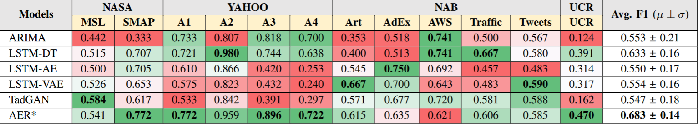

# RedLab Hack 2024

*MISIS PREZOY VYTASHIM team*

Team Members:
1) **Рыжичкин Кирилл** - ML Engineer, Frontend
2) **Чистов Егор** - Backend
3) **Плужников Артём** - ML Engineer, Design
4) **Кадомцев Андрей** - ML Engineer
5) **Силаев Всеволод** - ML Engineer

Презентация: [link](https://drive.google.com/)

Frontend: [prezoy.itatmisis.ru](https://prezoy.itatmisis.ru/)

API: 
[prezoy.itatmisis.ru/api](https://prezoy.itatmisis.ru/api/)

Swagger:
[prezoy.itatmisis.ru:8000/docs](http://prezoy.itatmisis.ru:8000/docs)

## Задача трека "Разработка модели для выявления аномалий во временном ряду"

Разработать минимальный прототип сервиса на python который будет анализировать временной ряд и размечать выявленные аномалии в данных. 

## Вводные данные

Cлепок данных телеметрии реальной системы для анализа и обучения модели. Данные представляют собой выгрузку из Clickhouse в формате TSV. 

Ключевые метрики: *Web Response, Throughput, APDEX, Error*

## Предложенное решение

Из данного нам слепка данных были извлечены необходимые метрики и загружены на Clickhouse, который развернут на удаленном сервере VK Remote. Мы предоставляем пользователю интерфейс, реализованный с помощью Streamlit, на котором он может получить данные из БД или загрузить собственноручно в формате csv. 

Далее предоставляется следующий пул моделей для детекции аномалий: 

- [AER: Auto-Encoder with Regression for Time Series Anomaly Detection](https://arxiv.org/pdf/2212.13558) - SOTA решение для поиска аномалий во временных рядах, хорошо работает с сезонностями, трендами.



- [Prophet](https://github.com/facebook/prophet) - Инструмент для создания высококачественных прогнозов для данных временных рядов, имеющих множественную сезонность с линейным или нелинейным ростом, на основе прогнозов и доверительного интервала мы детектируем аномалии.

- [Isolation Forest](https://en.wikipedia.org/wiki/Isolation_forest) - Классический инструмент машинного обучения для поиска аномалий, хорошо работает с данными разной природы.

- Multidimensional - Стэк из Isolation Forest, при выборе данного режима отключается выбор метрики, аномалии ищутся сразу по всем, а после выдается общая сводка.

Результаты работы каждого из этих алгоритмов отображаются с помощью plotly-виджетов, также найденные аномалии выводятся в виде таблицы (врямя, значение) и эту таблицу можно выгрузить в .csv формате (кнопка *Скачать CSV*).
Также даётся возможность выбрать временной отрезок, на котором нобходимо найти аномалии, для этого в полях *Выберите начальную дату* и *Выберите конечную дату* нужно выбрать даты, а в полях *Введите время начала* и *Введите время конца*
ввести время в формате hh:mm (по умолчанию 00:00)

Помимо страниц с поиском аномалий и закгрузкой данных есть страница для анализа временного ряда, там размещён базовый анализ корреляций метрик.

## Инструкция к запуску

Все образы выложены на docker hub, поэтому запуск будет относительно быстрый:
1. Из папки /src вызвать docker compose up
2. Подождать
3. На 8000 порту будет API, на 8501 - графический интерфейс StreamLit

## Формат API

Метод /find для получения всех аномалий, на вход принимает название колонки и модели, с помощью которых будет производиться обработка. Необязательный параметр data_source указывает на источник данных в ClickHouse, по умолчанию берутся данные из датасета.

```json
{
    "models": [
        "Autoencoder",
        "Isolation Forest",
        "Prophet"
    ],
    "column_name": "web_response",
    "data_source": {
        "host": "clickhouse_url",
        "port": "8123",
        "query": "SELECT timestamp, web_response FROM \"default\".\"test2\" ORDER BY timestamp ASC"
    }
}
```
